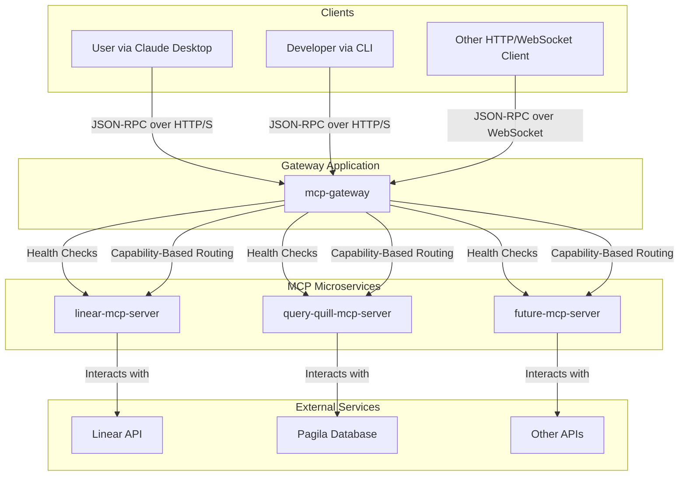

# Omni: System Architecture

This document provides a high-level overview of the Omni system architecture, which is designed as a
scalable, maintainable, and extensible monorepo.

## 🏛️ Core Philosophy

The architecture is built on two primary concepts:

1.  **The Gateway Pattern**: A central `mcp-gateway` acts as the single entry point for all clients.
    It is responsible for routing, authentication, session management, and protocol translation.
2.  **The MCP Server Pattern**: Independent, single-purpose microservices called "MCP Servers"
    provide specific capabilities (e.g., interacting with the Linear API, querying a database).

This separation of concerns allows for modular development, independent deployments, and clear
ownership of services.

## Diagram

## 🧩 Components

### 1. The Monorepo (`omni`)

The entire system is housed in a `pnpm` and `turborepo` powered monorepo.

- **`apps/`**: Contains the runnable applications (`gateway`, `linear-mcp-server`, etc.).
- **`packages/`**: Contains shared code used across applications:
  - `utils`: Common utilities and helpers.
  - `schemas`: Shared TypeScript interfaces and validation schemas.
  - `capabilities`: Capability definitions for the MCP ecosystem.
- **`docs/`**: Project documentation, including this document and the critical
  `MCP_SERVER_PATTERN.md`.

### 2. The Gateway (`apps/gateway`)

The `mcp-gateway` is the brain of the system.

- **Service Discovery**: It reads a configuration file that lists all available MCP servers.
- **Health Checking**: The `ServerManager` periodically polls the `/health` endpoint of each MCP
  server to ensure it's online and ready to accept requests. Unhealthy servers are taken out of the
  routing pool.
- **Capability Routing**: The gateway knows which "capabilities" (e.g., `tools/call` for
  `linear_search`) each MCP server provides. When a request arrives, it looks at the requested
  method and routes it to the appropriate, healthy server.
- **Request Proxying**: It forwards the incoming request to the correct MCP server's `/mcp` endpoint
  and returns the response to the client.
- **Protocol Abstraction**: It handles both HTTP and WebSocket connections, translating them into a
  consistent internal MCP format.
- **Session Management**: It manages client sessions, providing a consistent context for multi-turn
  interactions.

### 3. MCP Servers (`apps/*-mcp-server`)

MCP Servers are the workhorses. They are built following the strict `MCP_SERVER_PATTERN.md` guide.

- **Standardized Structure**: Each server has a consistent layout, including a `handlers.ts` for
  business logic and an `http-server.ts` for the transport layer. This makes them predictable and
  easy to develop.
- **Transport Agnostic Logic**: Business logic is decoupled from the Fastify HTTP server, making it
  easy to test and potentially deploy in different environments (e.g., serverless functions).
- **Health Endpoint**: Each server exposes a `/health` endpoint, which is crucial for the gateway's
  service discovery mechanism.
- **Single Responsibility**: Each server has a clear purpose, such as interacting with a specific
  third-party API or a database. For example:
  - `linear-mcp-server`: Provides tools for interacting with the Linear API.
  - `query-quill-mcp-server`: Provides tools for querying the internal Pagila database.

## 🚀 Workflow: A Tool Call Example

1.  A client sends an HTTP POST request to the `mcp-gateway` to execute the `linear_search` tool.
2.  The `MCPGateway` receives the request. The `ProtocolAdapter` transforms it into a standard
    `MCPRequest`.
3.  The gateway inspects the request and determines it's a `tools/call` for the `linear_search`
    capability.
4.  It consults its `capabilityMap` and finds that `linear-mcp-server` provides this capability.
5.  It asks the `ServerManager` for a healthy instance of `linear-mcp-server`. The `ServerManager`
    confirms it is healthy from its recent health checks.
6.  The gateway proxies the `MCPRequest` to `linear-mcp-server`'s `/mcp` endpoint.
7.  The `linear-mcp-server` receives the request. Its `http-server` routes it to the
    `handleLinearSearch` function in `handlers.ts`.
8.  The handler executes the business logic (calls the actual Linear API), gets the results, and
    returns an `MCPResponse`.
9.  The gateway receives the `MCPResponse` and forwards it back to the original client.
